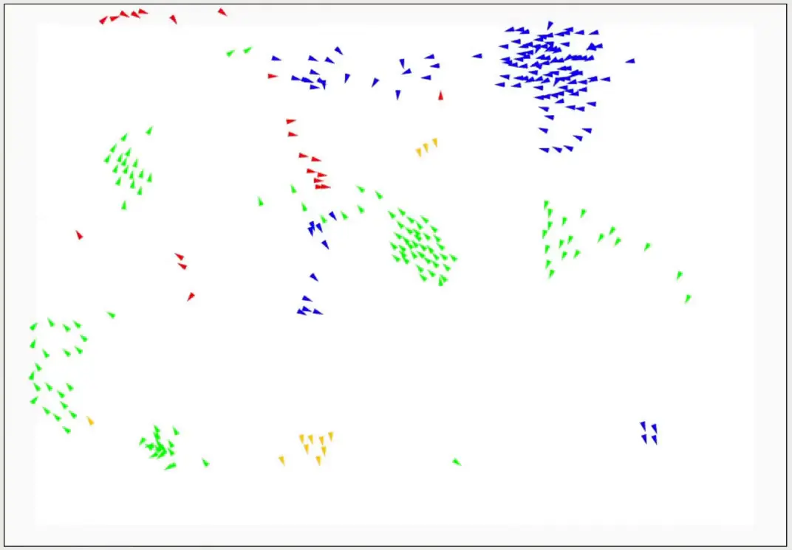

# 🐦 Boids: Flocking Simulation Engine

  <b>English</b> | <a href="README_zh.md">简体中文</a>

> **Demonstration Only:** This repository is intended for project showcasing only. If you are interested in discussing the implementation or technical details, please contact **<steven.ji@epfl.com>**.

*A lightweight flocking simulation engine demonstrating emergent artificial life behavior using functional programming principles.*

## 📖 Overview

**Boids** is a simulation engine that generates complex, realistic flocking behaviors from simple, localized rules. Inspired by Craig Reynolds' seminal 1986 artificial life program, this project simulates the emergent dynamics of bird flocks, fish schools, and insect swarms.

Instead of scripting individual paths, the engine dynamically computes interaction forces for every "boid" based on its immediate neighbors, creating organic collective movements in real-time.

  
   
  <em>Boids showcasing emergent flocking and predator-prey dynamics.</em>

### 🎯 Project Scope & Implementation Details

This project was developed within the framework of the EPFL CS-214 course.

- **Provided by the Course Framework**: The abstract structural traits, Graphical User Interface (GUI), the foundational immutable collections (`BoidSequence`, `Vector2Sequence`, `FloatSequence`), and core higher-order functional combinators.
- **Student Implementation**: The complete physics engine, emergent dynamics algorithms, and entity definitions, specifically contained within `Boid.scala`, `BoidLogic.scala`, and `BoidTest.scala` (totaling ~700 lines of rigorous Scala 3 code).

## 🧠 Core Mechanics: Under the Hood

### 1. The Foundational Flocking Rules

The engine simulates lifelike swarming by calculating aggregate forces representing different instincts. At every tick, every single boid assesses its neighbors within a precise **Perception Radius** and applies three fundamental rules:

- **Cohesion (Flock Centering)**: Boids are drawn toward the center of mass of their local flockmates, urging them to stay together.
- **Alignment (Velocity Matching)**: Boids steer to match the average speed and direction of their neighbors, maintaining orderly progression.
- **Avoidance (Separation)**: If a neighbor breaches a critical inner threshold (the *Avoidance Radius*), an opposing force pushes the boids apart to prevent collisions.

### 2. Advanced Emergent Dynamics & Custom Mechanics

Beyond standard rules, the simulation introduces complex predator-prey dynamics and specialized environmental forces:

- **Predator & Prey Mechanics**: Specific boid types are tagged as predators. The engine simulates a cyclical food chain across four distinct species (**Red ➔ Blue ➔ Yellow ➔ Green ➔ Red**), where each boid proactively flees from its specific predator and pursues its designated prey, creating dynamic, high-stakes hunting chases throughout the simulation window.
- **Crowd Penalties**: A unique mechanic where overly dense flocks suffer physical consequences. If local density exceeds a critical threshold, a targeted deceleration vector and minimum-speed handicap is applied, making large, dense swarms inherently more sluggish and structurally vulnerable to predators.

### 3. Performance Optimization: QuadTree

- **Computational Efficiency**: Implemented a custom `QuadTree` spatial index, refactoring the proximity search from $O(N^2)$ to $O(N \log N)$ complexity.
- **Spatial Partitioning**: Drastically reduced redundant distance checks by dynamically sub-dividing the 2D simulation space.
- **Scalability**: Benchmarked at **~8 Ticks Per Second** with **2,000 active boids**, enabling fluid real-time interaction for massive swarms.

## 👨‍💻 Personal Contributions

My core focus revolved around architecting the physics engine and the entity logic from scratch, specifically within the `Boid.scala` and `BoidLogic.scala` modules:

1. **High-Performance Spatial Partitioning (QuadTree)**: Individually architected and implemented a custom **QuadTree** data structure to replace the linear $O(N^2)$ accumulation logic. This optimized the proximity search to $O(N \log N)$, enabling the engine to support 2,000+ synchronized agents in real-time.
2. **Mathematical Flocking Implementation**: Engineered the core Cohesion, Alignment, and Avoidance algorithms using pure functional programming principles, ensuring deterministic and side-effect-free physics calculations.
3. **Advanced Pursuit Dynamics**: Designed and implemented the predator-prey pursuit logic, transforming random movement into a directed, cyclical ecosystem where entities intelligently **track targets** and **avoid threats**.
4. **Crowd Penalty System**: Designed the spatial density algorithm that dynamically handicaps dense swarms by applying deceleration and minimum-speed handicaps based on local population counts.

## ⚖️ License & Attribution

This project was developed by **Steven Ji**, **Elsa Sánchez Fernández** and **Nicolas Raymond Karmolinski**  as a 3-person team collaboration over 3 weeks in the Spring 2025 semester for the EPFL course [Software Construction (CS-214)](https://edu.epfl.ch/coursebook/en/software-construction-CS-214) (8 credits).

### Intellectual Property & Compliance

- **Course Materials:** All foundational frameworks, lab assignments, and base code are © 2023–2025 EPFL. In strict adherence to the course policy, no original course materials or source code are distributed in this repository.
- **Original Contributions:** The implementation logic, optimized system architecture, and specific functional extensions represent the original intellectual property of the authors.
- **Usage:** This repository serves solely as a portfolio showcase of the project's results, architectural design, and performance metrics.
